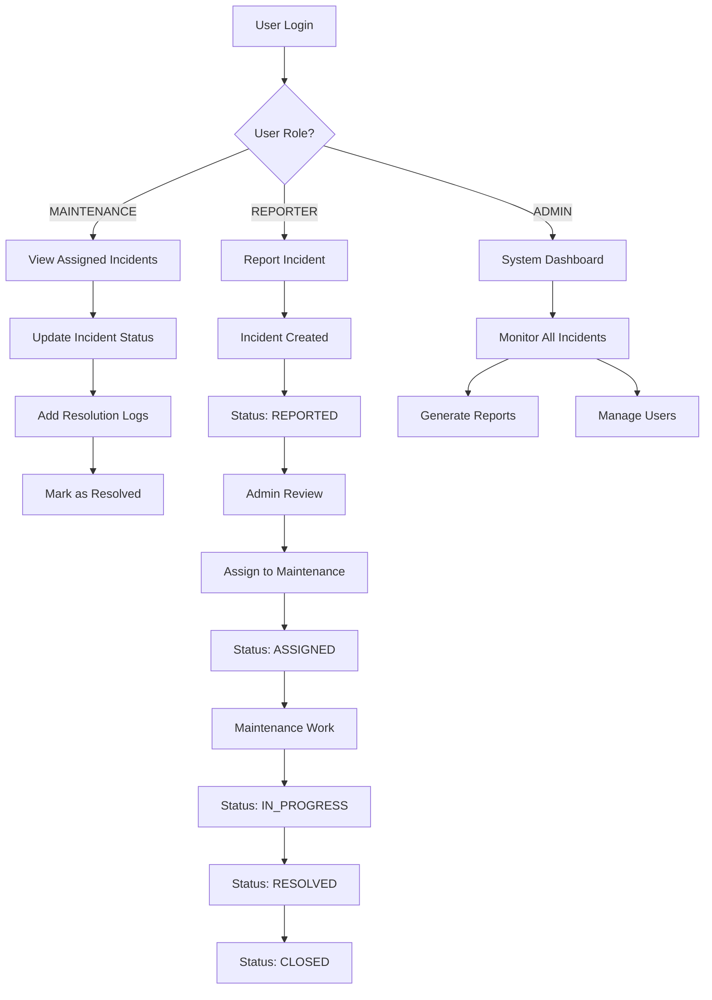
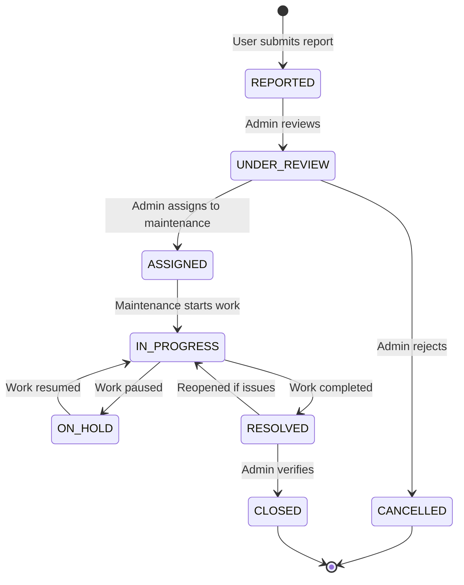
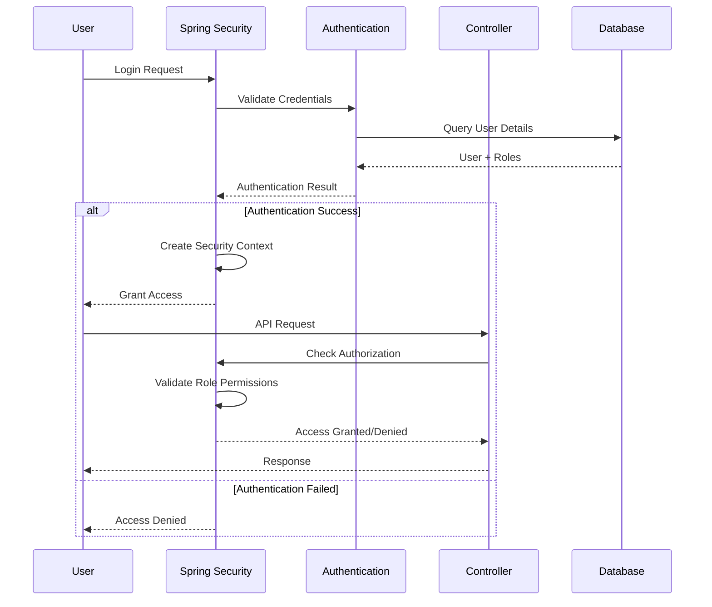
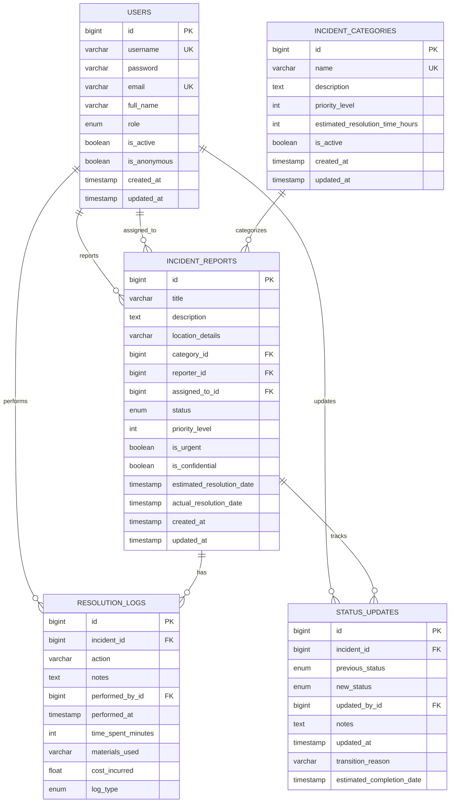

# 🏫 Campus Incident Reporting and Management System

## 📋 Table of Contents
- [Overview](#overview)
- [🚀 Quick Start](#quick-start)
- [👥 User Accounts & Roles](#user-accounts--roles)
- [🏗️ Project Structure](#project-structure)
- [🔄 System Workflow](#system-workflow)
- [🔧 Technical Architecture](#technical-architecture)
- [📱 Pages & Features](#pages--features)
- [🚀 Running the Project](#running-the-project)
- [🔐 API Endpoints](#api-endpoints)
- [📊 Database Schema](#database-schema)
- [🛠️ Development Guide](#development-guide)

---

## 🎯 Overview

A **comprehensive, enterprise-grade incident management system** designed for educational institutions to handle facility issues, safety problems, and equipment failures with proper workflow management and audit trails.

### ✨ Key Features
- **Anonymous Reporting** - Users can report issues without revealing identity
- **Role-Based Access Control** - Different permissions for different user types
- **Complete Incident Lifecycle** - From report to resolution with full tracking
- **Audit Trails** - Every action is logged and timestamped
- **Real-time Dashboard** - Live statistics and incident monitoring
- **Mobile-Friendly Interface** - Responsive design for all devices

---

## 🚀 Quick Start

### Prerequisites
- **Java 17** or higher
- **Maven 3.6+**
- **Git**

### Installation Steps
```bash
# 1. Clone the repository
git clone https://github.com/vbharyan01/Campus-Incident-Reporting-and-Management-System.git

# 2. Navigate to project directory
cd Campus-Incident-Reporting-and-Management-System

# 3. Build the project
mvn clean install

# 4. Run the application
mvn spring-boot:run
```

### Access Points
- **Main Application**: http://localhost:8080
- **H2 Database Console**: http://localhost:8080/h2-console
- **API Documentation**: Available via REST endpoints

---

## 👥 User Accounts & Roles

### 🔑 Default Login Credentials

| Username | Password | Role | Access Level | Description |
|----------|----------|------|--------------|-------------|
| `admin` | `admin123` | **ADMIN** | Full System Access | System administrator with complete control |
| `maintenance1` | `maintenance123` | **MAINTENANCE** | Incident Management | Can manage and resolve incidents |
| `maintenance2` | `maintenance123` | **MAINTENANCE** | Incident Management | Secondary maintenance staff |
| `reporter1` | `reporter123` | **REPORTER** | Report Creation | Student/faculty who can report issues |
| `reporter2` | `reporter123` | **REPORTER** | Report Creation | Additional reporter account |
| `anonymous1` | `anonymous123` | **REPORTER** | Anonymous Reporting | For sensitive issues requiring anonymity |

### 🎭 Role Permissions

#### **ADMIN Role**
- ✅ View all incidents and reports
- ✅ Manage user accounts and roles
- ✅ Access system analytics and reports
- ✅ Configure system settings
- ✅ Delete incidents and users
- ✅ Export data in various formats

#### **MAINTENANCE Role**
- ✅ View assigned incidents
- ✅ Update incident status and progress
- ✅ Add resolution logs and work notes
- ✅ Mark incidents as resolved
- ✅ View incident history and details
- ❌ Cannot delete incidents or manage users

#### **REPORTER Role**
- ✅ Create new incident reports
- ✅ View own reported incidents
- ✅ Update incident details (if not assigned)
- ✅ Add additional notes to reports
- ❌ Cannot view other users' incidents
- ❌ Cannot change incident status

---

## 🏗️ Project Structure

```
Campus-Incident-Reporting-and-Management-System/
├── 📁 src/
│   ├── 📁 main/
│   │   ├── 📁 java/com/campus/incident/
│   │   │   ├── 🚀 IncidentManagementApplication.java     # Main Spring Boot class
│   │   │   ├── 📁 config/                                # Configuration classes
│   │   │   │   ├── 🔐 SecurityConfig.java               # Spring Security configuration
│   │   │   │   └── 🗄️ DataInitializer.java             # Database initialization
│   │   │   ├── 📁 controller/                            # REST API controllers
│   │   │   │   ├── 🌐 IncidentController.java           # Incident management API
│   │   │   │   └── 🖥️ WebController.java               # Web interface controller
│   │   │   ├── 📁 entity/                                # JPA entities (database models)
│   │   │   │   ├── 👤 User.java                         # User accounts and roles
│   │   │   │   ├── 🚨 IncidentReport.java               # Main incident entity
│   │   │   │   ├── 🏷️ IncidentCategory.java            # Incident categories
│   │   │   │   ├── 📊 IncidentStatus.java               # Status enum
│   │   │   │   ├── 📝 ResolutionLog.java                # Work progress logs
│   │   │   │   └── 🔄 StatusUpdate.java                 # Status change history
│   │   │   ├── 📁 repository/                            # Data access layer
│   │   │   │   ├── 👥 UserRepository.java               # User data operations
│   │   │   │   ├── 🚨 IncidentReportRepository.java     # Incident data operations
│   │   │   │   └── 🏷️ IncidentCategoryRepository.java  # Category data operations
│   │   │   └── 📁 service/                               # Business logic layer
│   │   │       ├── 📋 IncidentService.java              # Service interface
│   │   │       └── 📁 impl/
│   │   │           └── 🔧 IncidentServiceImpl.java      # Service implementation
│   │   └── 📁 resources/                                 # Configuration and templates
│   │       ├── ⚙️ application.yml                       # Application configuration
│   │       └── 📁 templates/
│   │           └── 🖥️ index.html                        # Main web interface
│   └── 📁 test/                                          # Test classes
│       └── 🧪 IncidentManagementApplicationTests.java    # Basic test class
├── 📄 pom.xml                                            # Maven dependencies
├── 📄 README.md                                          # Basic project information
├── 📄 README_COMPLETE.md                                 # This comprehensive guide
├── 📄 PROJECT_SUMMARY.md                                 # Project achievements summary
└── 📄 .gitignore                                         # Git ignore rules
```

---

## 🔄 System Workflow

### 📊 High-Level System Flow



### 🚨 Incident Lifecycle Flow



### 🔐 Authentication & Authorization Flow



---

## 🔧 Technical Architecture

### 🏛️ Architecture Layers

```
┌─────────────────────────────────────────────────────────┐
│                    Presentation Layer                    │
│  ┌─────────────────┐  ┌─────────────────────────────┐  │
│  │   Web Interface │  │      REST API Endpoints     │  │
│  │   (Thymeleaf)   │  │    (IncidentController)    │  │
│  └─────────────────┘  └─────────────────────────────┘  │
└─────────────────────────────────────────────────────────┘
┌─────────────────────────────────────────────────────────┐
│                    Business Logic Layer                 │
│  ┌─────────────────────────────────────────────────────┐ │
│  │              IncidentService                        │ │
│  │  • Incident Management                             │ │
│  │  • Status Transitions                              │ │
│  │  • Role-Based Access Control                       │ │
│  │  • Business Rules & Validation                     │ │
│  └─────────────────────────────────────────────────────┘ │
└─────────────────────────────────────────────────────────┘
┌─────────────────────────────────────────────────────────┐
│                    Data Access Layer                    │
│  ┌─────────────────┐  ┌─────────────────────────────┐  │
│  │   Repositories  │  │      JPA Entities           │  │
│  │  (Spring Data)  │  │    (Hibernate ORM)         │  │
│  └─────────────────┘  └─────────────────────────────┘  │
└─────────────────────────────────────────────────────────┘
┌─────────────────────────────────────────────────────────┐
│                    Database Layer                       │
│  ┌─────────────────────────────────────────────────────┐ │
│  │              H2 In-Memory Database                 │ │
│  │  • Users, Incidents, Categories                   │ │
│  │  • Resolution Logs, Status Updates                │ │
│  │  • Foreign Key Relationships                      │ │
│  └─────────────────────────────────────────────────────┘ │
└─────────────────────────────────────────────────────────┘
```

### 🔒 Security Architecture

```
┌─────────────────────────────────────────────────────────┐
│                 Spring Security Filter Chain            │
├─────────────────────────────────────────────────────────┤
│ 1. DisableEncodeUrlFilter                              │
│ 2. WebAsyncManagerIntegrationFilter                    │
│ 3. SecurityContextHolderFilter                         │
│ 4. HeaderWriterFilter                                  │
│ 5. CorsFilter                                          │
│ 6. LogoutFilter                                        │
│ 7. BasicAuthenticationFilter ← Authentication          │
│ 8. RequestCacheAwareFilter                             │
│ 9. SecurityContextHolderAwareRequestFilter             │
│ 10. AnonymousAuthenticationFilter                      │
│ 11. ExceptionTranslationFilter                         │
│ 12. AuthorizationFilter ← Authorization                │
└─────────────────────────────────────────────────────────┘
```

---

## 📱 Pages & Features

### 🏠 Main Dashboard (`/`)
**Purpose**: Central hub for viewing system overview and quick actions

**Features**:
- 📊 **Live Statistics**: Total incidents, urgent cases, resolved count
- 🚨 **Recent Incidents**: Latest 5 incident reports
- 🔍 **Quick Search**: Search incidents by title or description
- 📈 **Status Distribution**: Visual breakdown of incident statuses
- ⚡ **Urgent Alerts**: Highlighted urgent incidents requiring attention

**User Access**:
- **ADMIN**: Full dashboard with all statistics
- **MAINTENANCE**: Limited to assigned incidents
- **REPORTER**: Limited to own reported incidents

**How It Works**:
1. User logs in and is redirected to dashboard
2. System queries database for relevant statistics
3. Dashboard renders with role-appropriate data
4. Real-time updates via AJAX calls to API endpoints

---

### 📝 Incident Creation (`/api/incidents` - POST)
**Purpose**: Allow users to submit new incident reports

**Features**:
- 📋 **Form Fields**: Title, description, location, category, priority
- 🏷️ **Category Selection**: Predefined incident categories
- ⚠️ **Priority Levels**: 1-5 scale with visual indicators
- 🔒 **Confidentiality**: Option for sensitive reports
- 📍 **Location Details**: Specific building/room information

**User Access**:
- **REPORTER**: Can create new incidents
- **MAINTENANCE**: Can create incidents for others
- **ADMIN**: Full creation capabilities

**How It Works**:
1. User fills out incident form
2. Frontend validates required fields
3. POST request sent to `/api/incidents`
4. Backend validates data and business rules
5. Incident saved to database with "REPORTED" status
6. Notification sent to relevant staff
7. User receives confirmation

---

### 🔍 Incident Management (`/api/incidents/{id}`)
**Purpose**: View, update, and manage individual incidents

**Features**:
- 📖 **Detailed View**: Complete incident information
- ✏️ **Edit Capabilities**: Update incident details
- 🔄 **Status Management**: Change incident status
- 👥 **Assignment**: Assign incidents to maintenance staff
- 📝 **Notes & Logs**: Add comments and progress updates

**User Access**:
- **ADMIN**: Full management capabilities
- **MAINTENANCE**: Can update assigned incidents
- **REPORTER**: Can update own incidents (limited fields)

**How It Works**:
1. User navigates to specific incident
2. System loads incident data with related entities
3. User makes changes and submits updates
4. Backend validates changes and business rules
5. Database updated with new information
6. Status change triggers workflow notifications
7. Audit trail maintained for all changes

---

### 📊 Incident List (`/api/incidents`)
**Purpose**: Browse and filter all incidents in the system

**Features**:
- 🔍 **Advanced Filtering**: By status, category, priority, date
- 📱 **Pagination**: Handle large numbers of incidents
- 🎯 **Search**: Text-based search across incident fields
- 📋 **Bulk Operations**: Select multiple incidents for actions
- 📈 **Sorting**: By various criteria (date, priority, status)

**User Access**:
- **ADMIN**: View all incidents with full filtering
- **MAINTENANCE**: View assigned and available incidents
- **REPORTER**: View only own incidents

**How It Works**:
1. User applies filters and search criteria
2. Frontend sends GET request with query parameters
3. Backend processes filters and queries database
4. Results returned with pagination metadata
5. Frontend renders incident list with controls
6. User can interact with individual incidents

---

### 👥 User Management (`/api/users`)
**Purpose**: Manage user accounts, roles, and permissions

**Features**:
- 👤 **User Profiles**: View and edit user information
- 🎭 **Role Management**: Assign and change user roles
- 🔒 **Account Status**: Enable/disable user accounts
- 📧 **Contact Information**: Email and name management
- 🔐 **Password Management**: Reset and change passwords

**User Access**:
- **ADMIN**: Full user management capabilities
- **MAINTENANCE**: View-only access to user list
- **REPORTER**: No access to user management

**How It Works**:
1. Admin navigates to user management section
2. System loads list of all users with current roles
3. Admin can edit user details and change roles
4. Changes validated against business rules
5. User account updated in database
6. Role changes trigger permission updates
7. Audit trail maintained for all changes

---

### 📈 Reports & Analytics (`/api/incidents/dashboard/stats`)
**Purpose**: Generate insights and reports on system performance

**Features**:
- 📊 **Dashboard Statistics**: Real-time incident counts
- 📅 **Time-based Analysis**: Trends over days/weeks/months
- 🏷️ **Category Breakdown**: Incidents by type and priority
- 👥 **User Performance**: Staff workload and efficiency
- 📋 **Export Capabilities**: CSV and PDF report generation

**User Access**:
- **ADMIN**: Full analytics and reporting
- **MAINTENANCE**: Limited to own performance metrics
- **REPORTER**: Basic statistics only

**How It Works**:
1. User requests dashboard or specific reports
2. Backend queries database for relevant metrics
3. Data aggregated and calculated in real-time
4. Results formatted and returned to frontend
5. Charts and graphs rendered with live data
6. Export functions generate downloadable reports

---

## 🚀 Running the Project

### 🏃‍♂️ Development Mode
```bash
# Start with hot reload
mvn spring-boot:run

# Or build and run JAR
mvn clean package
java -jar target/incident-management-1.0.0.jar
```

### 🐳 Docker Support (Future Enhancement)
```dockerfile
# Dockerfile for containerization
FROM openjdk:17-jdk-slim
COPY target/incident-management-1.0.0.jar app.jar
EXPOSE 8080
ENTRYPOINT ["java","-jar","/app.jar"]
```

### 🌍 Production Deployment
```bash
# Set production profile
export SPRING_PROFILES_ACTIVE=prod

# Configure external database
export SPRING_DATASOURCE_URL=jdbc:postgresql://localhost:5432/incidentdb

# Run with production settings
java -jar -Dspring.profiles.active=prod target/incident-management-1.0.0.jar
```

---

## 🔐 API Endpoints

### 📋 Incident Management
```
GET    /api/incidents                    # List all incidents
POST   /api/incidents                    # Create new incident
GET    /api/incidents/{id}              # Get incident details
PUT    /api/incidents/{id}              # Update incident
DELETE /api/incidents/{id}              # Delete incident
PATCH  /api/incidents/{id}/status      # Update incident status
POST   /api/incidents/{id}/assign      # Assign incident to user
```

### 📊 Dashboard & Analytics
```
GET    /api/incidents/dashboard/stats   # Dashboard statistics
GET    /api/incidents/recent            # Recent incidents
GET    /api/incidents/overdue           # Overdue incidents
GET    /api/incidents/urgent            # Urgent incidents
GET    /api/incidents/categories        # Incident categories
```

### 👥 User Management
```
GET    /api/users                       # List all users
GET    /api/users/{id}                  # Get user details
PUT    /api/users/{id}                  # Update user
POST   /api/users                       # Create new user
DELETE /api/users/{id}                  # Delete user
```

### 🔍 Search & Filtering
```
GET    /api/incidents/search            # Search incidents
GET    /api/incidents/filter            # Filter incidents
GET    /api/incidents/export            # Export incidents
```

---

## 📊 Database Schema

### 🗄️ Entity Relationships



---

## 🛠️ Development Guide

### 🔧 Adding New Features

#### 1. **Create Entity Class**
```java
@Entity
@Table("new_feature")
public class NewFeature {
    @Id
    @GeneratedValue(strategy = GenerationType.IDENTITY)
    private Long id;
    
    // Add fields with validation annotations
    @NotBlank
    @Size(max = 255)
    private String name;
    
    // Add relationships if needed
    @ManyToOne
    @JoinColumn(name = "incident_id")
    private IncidentReport incident;
}
```

#### 2. **Create Repository Interface**
```java
@Repository
public interface NewFeatureRepository extends JpaRepository<NewFeature, Long> {
    // Add custom query methods
    List<NewFeature> findByIncidentId(Long incidentId);
    
    @Query("SELECT nf FROM NewFeature nf WHERE nf.status = :status")
    List<NewFeature> findByCustomStatus(@Param("status") String status);
}
```

#### 3. **Create Service Interface & Implementation**
```java
public interface NewFeatureService {
    NewFeature createNewFeature(NewFeature feature);
    List<NewFeature> getFeaturesByIncident(Long incidentId);
}

@Service
@Transactional
public class NewFeatureServiceImpl implements NewFeatureService {
    @Autowired
    private NewFeatureRepository repository;
    
    // Implement methods with business logic
}
```

#### 4. **Create Controller**
```java
@RestController
@RequestMapping("/api/new-features")
public class NewFeatureController {
    @Autowired
    private NewFeatureService service;
    
    @PostMapping
    public ResponseEntity<NewFeature> create(@RequestBody NewFeature feature) {
        return ResponseEntity.ok(service.createNewFeature(feature));
    }
}
```

### 🧪 Testing

#### **Unit Tests**
```java
@ExtendWith(MockitoExtension.class)
class NewFeatureServiceTest {
    @Mock
    private NewFeatureRepository repository;
    
    @InjectMocks
    private NewFeatureServiceImpl service;
    
    @Test
    void shouldCreateNewFeature() {
        // Test implementation
    }
}
```

#### **Integration Tests**
```java
@SpringBootTest
@AutoConfigureTestDatabase
class NewFeatureIntegrationTest {
    @Test
    void shouldSaveAndRetrieveFeature() {
        // Test with actual database
    }
}
```

### 🔒 Security Considerations

#### **Adding New Endpoints**
```java
@PreAuthorize("hasRole('ADMIN') or hasRole('MAINTENANCE')")
@GetMapping("/api/secure-endpoint")
public ResponseEntity<?> secureEndpoint() {
    // Only ADMIN and MAINTENANCE can access
}
```

#### **Custom Security Rules**
```java
@Component
public class CustomPermissionEvaluator implements PermissionEvaluator {
    @Override
    public boolean hasPermission(Authentication auth, Object targetDomainObject, Object permission) {
        // Custom permission logic
    }
}
```

---

## 📚 Additional Resources

### 🔗 Useful Links
- [Spring Boot Documentation](https://spring.io/projects/spring-boot)
- [Spring Security Reference](https://docs.spring.io/spring-security/site/docs/current/reference/html5/)
- [Spring Data JPA](https://docs.spring.io/spring-data/jpa/docs/current/reference/html/)
- [H2 Database Console](http://localhost:8080/h2-console)

### 📖 Learning Resources
- **Spring Boot**: Official guides and tutorials
- **JPA/Hibernate**: Entity mapping and relationships
- **Spring Security**: Authentication and authorization
- **RESTful APIs**: Design principles and best practices

### 🆘 Troubleshooting

#### **Common Issues**
1. **Port 8080 already in use**: Change port in `application.yml`
2. **Database connection failed**: Check H2 console access
3. **Authentication errors**: Verify user credentials in database
4. **Build failures**: Ensure Java 17+ and Maven 3.6+

#### **Debug Mode**
```bash
# Enable debug logging
export LOGGING_LEVEL_COM_CAMPUS_INCIDENT=DEBUG
export LOGGING_LEVEL_ORG_SPRINGFRAMEWORK_SECURITY=DEBUG

# Run with debug profile
mvn spring-boot:run -Dspring-boot.run.profiles=debug
```

---

## 🎉 Conclusion

This Campus Incident Reporting and Management System provides a **robust, scalable, and secure solution** for educational institutions to manage facility issues effectively. With its comprehensive feature set, role-based access control, and detailed audit trails, it demonstrates enterprise-grade software engineering practices.

The system is designed to be:
- **Easy to use** for all user types
- **Secure** with proper authentication and authorization
- **Scalable** for growing institutions
- **Maintainable** with clean code architecture
- **Extensible** for future enhancements

For questions, issues, or contributions, please refer to the project repository or contact the development team.

---

**Happy Incident Management! 🚀**
